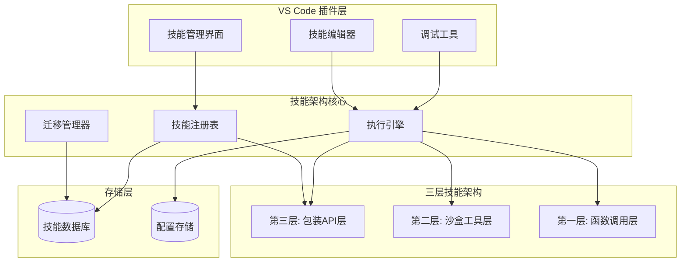

# 通用技能架构系统设计文档

## 概述

通用技能架构系统是一个基于分层架构的可迁移技能管理平台。系统采用三层架构设计，提供从底层原子操作到高级API包装的完整技能生态。核心设计理念是创建一个标准化、可扩展、跨平台的技能定义和执行框架。

## 架构

### 整体架构



### 分层架构详细设计

#### 第一层：函数调用层（原子操作）
- **定位**: 提供最基础的原子操作接口
- **特点**: 直接、快速、确定性强
- **内容**: 文件读写、数据处理、基础计算
- **接口**: 同步/异步函数调用

#### 第二层：沙盒工具层（命令行程序）
- **定位**: 提供工具和命令的安全执行环境
- **特点**: 隔离执行、可扩展、渐进处理
- **内容**: Shell命令、外部工具调用、脚本执行
- **接口**: 进程管理和通信

#### 第三层：包装API层（编程和执行代码）
- **定位**: 提供高级抽象和复合功能
- **特点**: 智能组合、上下文感知、完整解决方案
- **内容**: 复杂业务逻辑、多步骤工作流、智能决策
- **接口**: RESTful API 和 SDK

## 组件和接口

### 核心组件

#### 1. 技能定义引擎 (SkillDefinitionEngine)
```typescript
interface SkillDefinition {
  id: string;
  name: string;
  version: string;
  layer: 1 | 2 | 3;
  description: string;
  invocationSpec: InvocationSpecification;
  extensionPoints: ExtensionPoint[];
  dependencies: Dependency[];
  metadata: SkillMetadata;
}

interface InvocationSpecification {
  inputSchema: JSONSchema;
  outputSchema: JSONSchema;
  executionContext: ExecutionContext;
  parameters: Parameter[];
  examples: Example[];
}
```

#### 2. 技能注册表 (SkillRegistry)
```typescript
interface SkillRegistry {
  register(skill: SkillDefinition): Promise<void>;
  discover(query: SkillQuery): Promise<SkillDefinition[]>;
  resolve(skillId: string): Promise<SkillDefinition>;
  validate(skill: SkillDefinition): ValidationResult;
  getByLayer(layer: number): Promise<SkillDefinition[]>;
}
```

#### 3. 执行引擎 (ExecutionEngine)
```typescript
interface ExecutionEngine {
  execute(skillId: string, params: any): Promise<ExecutionResult>;
  executeLayer1(skill: SkillDefinition, params: any): Promise<any>;
  executeLayer2(skill: SkillDefinition, params: any): Promise<any>;
  executeLayer3(skill: SkillDefinition, params: any): Promise<any>;
  createSandbox(): SandboxEnvironment;
}
```

#### 4. 扩展管理器 (ExtensionManager)
```typescript
interface ExtensionManager {
  extend(baseSkillId: string, extension: SkillExtension): Promise<string>;
  compose(skillIds: string[]): Promise<SkillDefinition>;
  resolveConflicts(conflicts: ExtensionConflict[]): Promise<Resolution>;
  validateExtension(extension: SkillExtension): ValidationResult;
}
```

#### 5. 迁移管理器 (MigrationManager)
```typescript
interface MigrationManager {
  export(projectPath: string): Promise<SkillPackage>;
  import(package: SkillPackage, targetPath: string): Promise<MigrationResult>;
  validateCompatibility(package: SkillPackage, environment: Environment): Promise<CompatibilityReport>;
  adaptConfiguration(config: SkillConfig, environment: Environment): Promise<SkillConfig>;
}
```

### VS Code 插件接口

#### 1. 技能管理面板
```typescript
interface SkillManagementPanel {
  showSkillTree(): void;
  createSkill(): Promise<SkillDefinition>;
  editSkill(skillId: string): Promise<void>;
  deleteSkill(skillId: string): Promise<void>;
  testSkill(skillId: string): Promise<TestResult>;
}
```

#### 2. 技能编辑器
```typescript
interface SkillEditor {
  openSkillEditor(skill: SkillDefinition): void;
  validateSyntax(): ValidationResult;
  previewExecution(): Promise<ExecutionResult>;
  saveSkill(): Promise<void>;
  exportSkill(): Promise<string>;
}
```

## 数据模型

### 技能数据模型
```typescript
interface Skill {
  definition: SkillDefinition;
  implementation: SkillImplementation;
  extensions: SkillExtension[];
  usage: UsageStatistics;
  relationships: SkillRelationship[];
}

interface SkillImplementation {
  layer1?: FunctionImplementation;
  layer2?: CommandImplementation;
  layer3?: APIImplementation;
}

interface SkillExtension {
  id: string;
  baseSkillId: string;
  type: 'override' | 'compose' | 'decorate';
  implementation: any;
  priority: number;
}
```

### 配置数据模型
```typescript
interface ProjectConfiguration {
  skillsPath: string;
  enabledLayers: number[];
  environmentVariables: Record<string, string>;
  dependencies: ProjectDependency[];
  migrationSettings: MigrationSettings;
}

interface EnvironmentContext {
  platform: string;
  runtime: string;
  capabilities: string[];
  constraints: ResourceConstraint[];
}
```

## 正确性属性

*属性是应该在系统的所有有效执行中保持为真的特征或行为——本质上是关于系统应该做什么的正式声明。属性作为人类可读规范和机器可验证正确性保证之间的桥梁。*
基于预工作分析，以下是系统的核心正确性属性：

### 属性 1: 技能定义模板一致性
*对于任何*开发者的技能创建请求，系统应该返回符合标准化格式的技能定义模板
**验证: 需求 1.1**

### 属性 2: 技能信息完整性
*对于任何*技能定义或查询，系统应该确保包含调用说明、扩展接口和所有必需的元数据
**验证: 需求 1.2, 3.2**

### 属性 3: 通用验证一致性
*对于任何*技能定义、导入配置或扩展注册，系统应该执行适当的验证并正确接受有效输入、拒绝无效输入
**验证: 需求 1.3, 4.2, 6.3**

### 属性 4: 注册查询往返
*对于任何*有效技能，注册后通过查询应该能够检索到相同的技能定义
**验证: 需求 1.4, 1.5**

### 属性 5: 分层接口特性
*对于任何*层级访问，系统应该提供该层级特有的接口特性（第一层原子操作、第二层沙盒环境、第三层API包装）
**验证: 需求 2.2, 2.3, 2.4**

### 属性 6: 层间边界维护
*对于任何*跨层交互，系统应该维护清晰的接口边界和一致的数据流
**验证: 需求 2.5**

### 属性 7: 查询相关性
*对于任何*技能查询，返回的技能列表应该与任务描述相关且按相关性排序
**验证: 需求 3.1**

### 属性 8: 执行结果一致性
*对于任何*有效的技能调用，系统应该处理调用并返回符合预期格式的执行结果
**验证: 需求 3.3**

### 属性 9: 错误处理完整性
*对于任何*执行失败的情况，系统应该提供有意义的错误信息和可行的替代方案
**验证: 需求 3.4**

### 属性 10: 执行日志记录
*对于任何*技能执行完成，系统应该生成包含执行日志和性能指标的记录
**验证: 需求 3.5**

### 属性 11: 配置导出完整性
*对于任何*技能配置导出操作，系统应该生成包含所有必要信息的独立配置包
**验证: 需求 4.1**

### 属性 12: 依赖解析一致性
*对于任何*有外部依赖的技能，系统应该能够正确识别、管理和解析所有依赖关系
**验证: 需求 4.3**

### 属性 13: 环境适配能力
*对于任何*环境差异，系统应该能够动态映射配置参数以适应目标环境
**验证: 需求 4.4**

### 属性 14: 迁移完整性验证
*对于任何*迁移操作完成后，所有原有技能应该在新环境中保持可用性
**验证: 需求 4.5**

### 属性 15: UI功能一致性
*对于任何*VS Code插件操作（浏览、创建、测试），应该提供相应的UI功能和用户反馈
**验证: 需求 5.2, 5.3, 5.4**

### 属性 16: 同步通知机制
*对于任何*技能更新事件，插件应该自动同步变更并向用户发送通知
**验证: 需求 5.5**

### 属性 17: 扩展机制支持
*对于任何*技能扩展操作，系统应该提供继承和组合机制来实现功能扩展
**验证: 需求 6.1**

### 属性 18: 向后兼容性保持
*对于任何*技能行为修改，系统应该确保现有功能和接口保持向后兼容
**验证: 需求 6.2**

### 属性 19: 扩展路由正确性
*对于任何*扩展技能调用，系统应该正确路由到对应的扩展实现而不是基础实现
**验证: 需求 6.4**

### 属性 20: 冲突解决机制
*对于任何*扩展冲突情况，系统应该提供明确的解决机制和优先级管理策略
**验证: 需求 6.5**

## 错误处理

### 错误分类和处理策略

#### 1. 技能定义错误
- **语法错误**: 提供详细的语法错误位置和修复建议
- **语义错误**: 验证技能逻辑的一致性和完整性
- **依赖错误**: 检查和解析技能依赖关系

#### 2. 执行时错误
- **运行时异常**: 捕获并包装执行过程中的异常
- **资源不足**: 处理内存、CPU、网络等资源限制
- **权限错误**: 管理文件系统和网络访问权限

#### 3. 迁移错误
- **兼容性错误**: 检测和报告环境兼容性问题
- **配置错误**: 验证和修复配置参数映射
- **依赖缺失**: 识别和解决缺失的依赖项

#### 4. 扩展错误
- **冲突错误**: 检测和解决扩展之间的冲突
- **版本错误**: 管理技能和扩展的版本兼容性
- **接口错误**: 验证扩展接口的正确实现

### 错误恢复机制

```typescript
interface ErrorRecoveryStrategy {
  canRecover(error: SystemError): boolean;
  recover(error: SystemError): Promise<RecoveryResult>;
  fallback(error: SystemError): Promise<FallbackResult>;
}

interface SystemError {
  type: ErrorType;
  severity: ErrorSeverity;
  context: ErrorContext;
  suggestions: RecoverySuggestion[];
}
```

## 测试策略

### 双重测试方法

系统将采用单元测试和基于属性的测试相结合的综合测试策略：

#### 单元测试
- **具体示例验证**: 测试特定的技能定义、执行场景和边界条件
- **集成点测试**: 验证组件之间的接口和数据流
- **错误条件测试**: 测试各种错误情况的处理和恢复

#### 基于属性的测试
- **使用框架**: 采用 fast-check (JavaScript/TypeScript) 进行基于属性的测试
- **测试配置**: 每个属性测试运行最少100次迭代以确保随机性覆盖
- **属性标记**: 每个基于属性的测试必须使用注释明确引用设计文档中的正确性属性
- **标记格式**: 使用格式 '**Feature: universal-skills-architecture, Property {number}: {property_text}**'

#### 测试覆盖范围
- **功能测试**: 验证所有核心功能的正确性
- **性能测试**: 测试系统在不同负载下的表现
- **兼容性测试**: 验证跨平台和跨环境的兼容性
- **安全测试**: 测试沙盒隔离和权限管理的有效性

### 测试数据生成策略

```typescript
// 智能生成器示例
interface SkillGenerator {
  generateValidSkill(): SkillDefinition;
  generateInvalidSkill(): SkillDefinition;
  generateSkillWithDependencies(): SkillDefinition;
  generateExtensionScenario(): ExtensionScenario;
}
```

测试生成器将智能约束输入空间，确保生成的测试数据覆盖各种边界条件和实际使用场景。